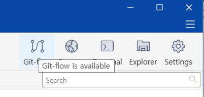

 

# Git_Flow

> Git Flow는 기능이 아니라 개념 또는 방법론 이다. 

> Git History를 어떠한 방식으로 관리하느냐에 따라 회사, 팀 더 나아가 개인까지도 전략이 다를 수 있다. 

> Git Flow는 회사, 팀 별 Commit History전략에 대한 상호간 합의가 필요한 개념이다. 

[ GIT Flow 개념 개발자 블로그 Link ](https://nvie.com/posts/a-successful-git-branching-model/)

  

## **Git-flow에서 사용하는 브랜치**

### 1. 메인 브랜치 ( 항상 Remote에 유지 )

- **Master(main)**
- **Develop**

### 2. 서포트 브랜치 ( 주로 Local에서 작업 )

- **Feature/****
- **Release-****
- **Hotfix-****

 

> - 기본적인 가이드는 메인 브랜치(master, develop)에서 직접 작업하여 커밋하지 않고, 서포트 브랜치의 작업을 메인 브랜치에 반영하여 Commit History를 관리한다.  
> - 서포트 브랜치는 직접적인 작업을 하는 브랜치이다. 주로 로컬에서 작업을하고 작업이 끝나면 메인 브랜치에 병합(merge)된 뒤에 작업이 끝난 브랜치는 삭제하며 Commit History를 관리한다. 

  

### 1-1 Master 브랜치

- master 브랜치는 운영 단계의 브랜치이다. 이 브랜치의 Commit 상태가 운영중인 코드와 상태가 동일해야한다.

### 1-2 Develop 브랜치

- develop 브랜치는 개발 단계의 브랜치이다. 개발이 진행되며 feature/** 브랜치에서 작업 결과물들을 이 브랜치에 병합시켜 쌓아간다. 
- master 브랜치와 직접적으로 병합을 하지 않지만, 개발된 기능을 운영에 반영할 때(버전 업) master 브랜치와 동일한 상태를 만들고 이후 버전 개발을 진행한다. 

 

### 2-1 Feature 브랜치

- feature 브랜치는 항상 develop 브랜치를 base로 생성한다. 
- 브랜치 네이밍은 feature/loginPage, feature/userInfo 와같이 feature/ 뒤에 기능의 이름을 붙인다.
- 주로 local 브랜치로 사용하고 작업이 끝나면 develop 브랜치로 병합시킨다. 
- 같은 기능을 2명 이상의 개발자가 작업한다면, 브랜치를 remote로 옮기고 pull/push 하며 공동 작업한다.
- 작업이 끝난 feature 브랜치들은 develop 브랜치 병합 작업이 끝나면 삭제한다.

### 2-2 Release 브랜치

- Release 브랜치는 develop 브랜치를 기준으로 생성한다.
- 브랜치 네이밍은 release-0.1, release-1.5 같은 형식으로 release- 뒤에 운영 버전명을 붙여 생성한다.
- release 브랜치의 생성시점은 개발작업이 마무리되어 운영에 반영하기 전이다.
- 생성된 후 운영에 반영하기 위한 작업을 한 뒤, master, develop에 각각 병합시킨다.
- master에 병합하고 나면 release의 버전명을 master 브랜치에 태그로 달아준다.
- 주로 local에서 작업하고, 병합이 완료된 후 release 브랜치를 삭제한다.

### 2-3 Hotfix 브랜치

- Hotfix 브랜치는 운영 중 발생하는 이슈를 빠르게 해결하기 위한 브랜치이다. 
- 브랜치 네이밍은 hotfix-0.1.1, hotfix-1.5.4 같은 형식으로 업데이트 버전명을 붙여 생성한다.
- develop 브랜치의 상태가 master와 차이가 났을 때 바로 반영하기 힘들기 때문에 hotfix 브랜치를 생성한다. 
- master 브랜치를 기준으로 생성된다. 
- release 브랜치와 동일하게 작업이 완료되면 master, develop에 각각 병합시킨다.
- 작업이 완료되면 브랜치를 삭제한다.

 

---

 

# With Sourcetree

> git 클라이언트 프로그램인 sourcetree에서 git-flow 개념을 보다 쉽게 사용할 수 있도록 도와준다. 

 

- Flow 기능 사용 버튼

 

- Git-Flow 기본 사용설정 & 시작

 

---

 

# History - Reset / Revert

---

## # Reset

- Git Reset 기능은 브랜치의 해드를 특정 커밋으로 이동시키는 것이다.
- 다른 브랜치로 reset도 가능하다.
- 커밋 되돌리기로도 사용하지만 브랜치 정리를 위해 사용하기도 한다.
- Reset은 총 3가지의 옵션을 갖는다. ( Hard, Mixed, Soft ).

